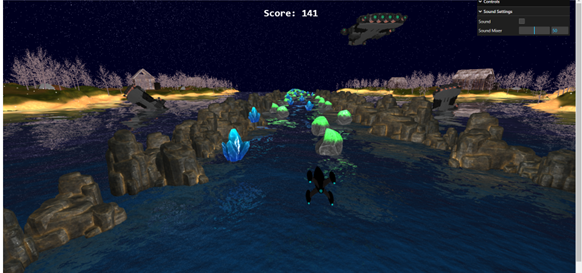
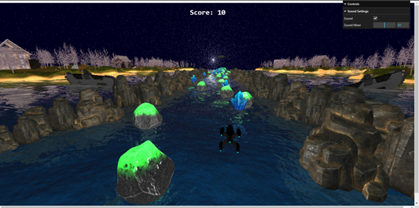
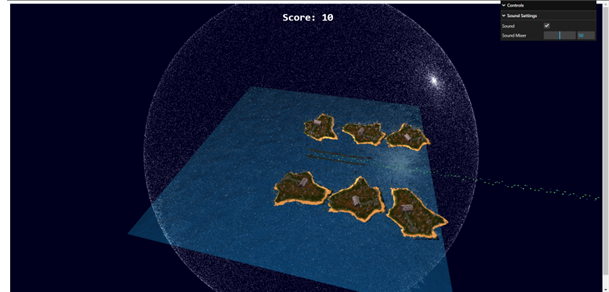

# Game-Staged-infinite-Runner
## This project is a course project for Computer Graphics Course CSE378 at Faculty of Engineering Ain Shams University
#### main idea of the project is an infinite running game with a rocket collecting some pickups trying to catch the mothership

#### during the running loop of the game the rocket faces many obstacles that slows it down and drain its score
#### while the rocket is moving he can see some motherships drown besides the islands and yet it continues to move trying to catch these flying ships

#### this game regenerates and renders scene elements that go out of the viewing frustum and translates them to their new positions with some shifts in orientations

